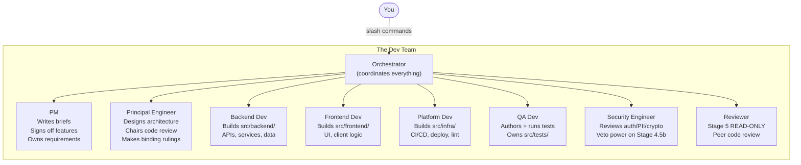
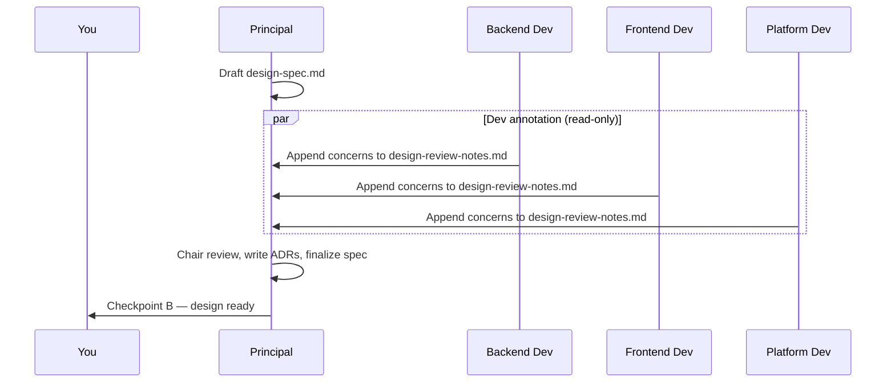
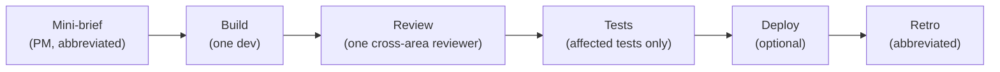
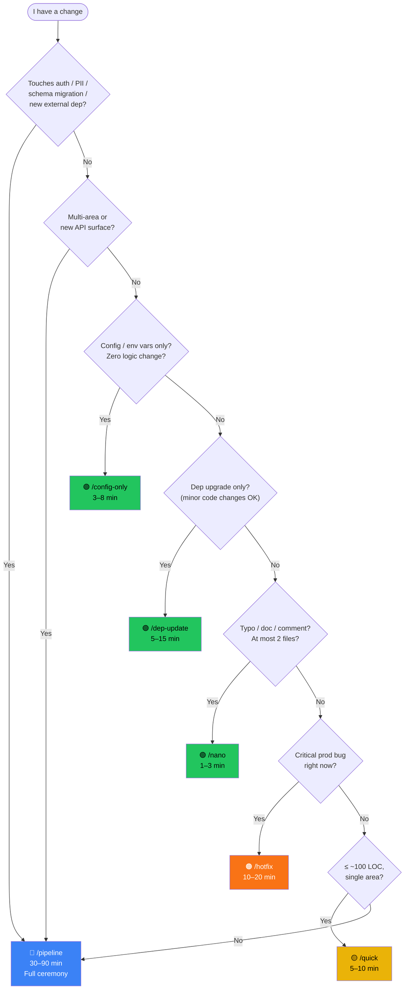

# claude-dev-team — User Guide

A simulated software development team inside Claude Code.

---

## What Is This?

When you run `/pipeline add user authentication`, you're not prompting a single AI.
You're dispatching work to a coordinated team of eight specialists — each with its
own role, file permissions, and accountability — running a structured, gate-enforced
software development lifecycle.

The team briefs requirements, designs the architecture, builds in parallel worktrees,
reviews each other's code, tests against acceptance criteria, deploys, and learns from
every run. You stay in the loop at three explicit checkpoints, and the pipeline halts
for your decision whenever it hits something it can't resolve on its own.

> **Prerequisite:** Claude Code CLI installed and authenticated. A Git repository.
> About 10 minutes to run `./bootstrap.sh` and you're set.

---

## Meet the Team



Each agent is scoped to its area. Backend Dev can't write to `src/frontend/`.
The Security Engineer can halt the entire pipeline. The PM approves features —
and can send them back to Stage 4 with a delta list.

---

## The Pipeline at a Glance

```mermaid
flowchart LR
    You([You]) --> S1

    S1["Stage 1\nPM writes brief\n& acceptance\ncriteria"]
    S1 --> CPA{{"Checkpoint A\nYou review\nthe brief"}}
    CPA --> S2

    S2["Stage 2\nPrincipal designs\narchitecture\nDevs annotate"]
    S2 --> CPB{{"Checkpoint B\nYou review\nthe design"}}
    CPB --> S3

    S3["Stage 3\nClarify any\nopen questions"]
    S3 --> S4

    S4["Stage 4\nBuild\n3 devs in\nparallel worktrees"]
    S4 --> S45a

    S45a["Stage 4.5a\nLint + type-check\n+ dependency scan\nPlatform Dev"]
    S45a --> S45b

    S45b{"Stage 4.5b\nSecurity review\nonly if heuristic\nfires"}
    S45b --> S5

    S5["Stage 5\nPeer code review\nCross-area agents\nread-only pass"]
    S5 --> S6

    S6["Stage 6\nTest & CI\nQA Dev runs\nall tests"]
    S6 --> CPC{{"Checkpoint C\nYou review\ntest results"}}
    CPC --> S7

    S7["Stage 7\nPM sign-off\n(or auto-fold\nif tests are clean)"]
    S7 --> S8

    S8["Stage 8\nDeploy\nadapter-driven\nwith runbook check"]
    S8 --> S9

    S9["Stage 9\nRetrospective\nAll agents\nLessons promoted"]
```

This is what happens when you type `/pipeline <feature>`:



**Your three moments of control** are Checkpoints A, B, and C. Everything between
them runs automatically. You can also configure checkpoints to auto-pass when
conditions are met (see [Opt-in Features](#opt-in-features)).

---

## Getting Started

### 1. Install

```bash
# Option A: bash (requires rsync)
curl -fsSL https://raw.githubusercontent.com/mumit/claude-dev-team/main/bootstrap.sh | bash

# Option B: Node (no rsync required)
git clone https://github.com/mumit/claude-dev-team.git
node claude-dev-team/scripts/bootstrap.js /path/to/my-project
```

The installer creates `.claude/` with agents, rules, hooks, skills, and commands.
It never touches your `CLAUDE.md`, `src/`, or any `*.local.*` files.

### 2. Verify

```bash
# Check it worked
ls .claude/agents/    # pm.md, principal.md, dev-backend.md ...
ls .claude/commands/  # pipeline.md, quick.md, nano.md ...
```

### 3. Your first pipeline

Open Claude Code in your project directory and type:

```
/pipeline add a health check endpoint to the API
```

That's it. The orchestrator takes over. Your next action is Checkpoint A.

---

## Use Cases & Journeys

Choose your scenario below to walk through the full experience.

---

### Journey 1: Shipping a New Feature

**When to use:** Multi-area change, new API, anything involving auth/PII, or
you're not sure which track fits. When in doubt, `/pipeline` is always safe.

**Time:** 30–90 minutes.

---

#### Step 1 — You kick it off

```
/pipeline add user authentication with JWT tokens
```

The orchestrator reads the pipeline rules, checks `pipeline/lessons-learned.md`
for accumulated team wisdom, and dispatches the PM.

---

#### Step 2 — PM writes the brief (Stage 1)

The PM agent drafts `pipeline/brief.md`. It includes:

- User stories
- Acceptance criteria (numbered, testable)
- Out-of-scope items
- Rollback plan, feature flag, observability, SLO considerations

**Checkpoint A — you review the brief.**

The pipeline halts and shows you a summary. You read `pipeline/brief.md` and type:

```
proceed
```

Or, if something's off:

```
The brief says JWT expiry is 24h but we need 15 minutes for compliance.
```

The PM revises and halts again. You proceed when it's right.

---

#### Step 3 — Principal designs the architecture (Stage 2)



When the Principal chairs the review, it reads all dev concerns, may update the
spec, and writes Architecture Decision Records (ADRs) to `pipeline/adr/` for any
significant call (e.g., "chose RS256 over HS256 because…").

**Checkpoint B — you review the design.**

You read `pipeline/design-spec.md` and the ADRs. Type `proceed`.

---

#### Step 4 — Build (Stage 4)

Three developers work in parallel git worktrees so their changes don't conflict:

```
.
├── your-project/          ← main worktree (you're here)
├── dev-team-backend/      ← feature/backend branch
├── dev-team-frontend/     ← feature/frontend branch
└── dev-team-platform/     ← feature/platform branch
```

Each dev writes to their own area only. Before the first edit, each records
their assumptions in `pipeline/context.md` — ambiguous choices are surfaced
as `QUESTION:` lines, not silent decisions.

This is the longest stage. Progress is written to `pipeline/pr-{area}.md`
as each dev works.

---

#### Step 5 — Automated checks (Stage 4.5)

Before human reviewers see the code, the toolchain catches what it already knows:

```
Stage 4.5a  →  lint ✓  type-check ✓  dependency scan ✓  license check ✓

Stage 4.5b  →  [auth paths detected]
               Security Engineer reviewing...
               security_approved: true  veto: false  ✓
```

If Stage 4.5a fails, the owning dev is sent back to fix it. Stage 5 doesn't
start until automated checks are green.

If auth/crypto/PII files changed, the Security Engineer reviews automatically.
A `veto: true` halts everything — no peer-review approval can override it.

---

#### Step 6 — Cross-area code review (Stage 5)

Reviewers are read-only. They can't touch `src/`. If they find a blocker:

1. They write `REVIEW: CHANGES REQUESTED` in their review file
2. The orchestrator re-invokes the owning dev to fix it
3. The reviewer re-reviews (maximum 2 rounds; if still blocked, the Principal makes a binding ruling)

The `approval-derivation.js` hook parses review files and updates gate files
automatically — no agent grades their own work.

---

#### Step 7 — Tests (Stage 6)

The QA Dev writes and runs tests against the acceptance criteria from the brief.
Every criterion maps to at least one test. Results go to `pipeline/test-report.md`.

**Checkpoint C — you review the test results.**

If everything's green and the criterion-to-test mapping is 1:1, Stage 7
(PM sign-off) auto-folds — the pipeline doesn't bother the PM when the
evidence already says "ship it."

---

#### Step 8 — Deploy (Stage 8)

The Platform Dev reads your configured deploy adapter (default: `docker-compose`)
from `.claude/config.yml` and follows its instructions. Before any deploy:

- `pipeline/runbook.md` must exist with `## Rollback` and `## Health signals`
- The deploy log points to the runbook — if it fails, the pipeline surfaces
  the rollback pointer and waits for you. It never auto-rollbacks.

---

#### Step 9 — Retrospective (Stage 9)

All agents contribute a section to `pipeline/retrospective.md` covering what
worked, what went wrong, and one concrete lesson. The Principal synthesises and
promotes at most two lessons to `pipeline/lessons-learned.md` — a file that
**survives `/reset`**. Every future run starts smarter.

```
## Synthesis — 2026-04-23 — feature: JWT authentication
- Severity: yellow
- Top theme: brief under-specified token expiry requirements
- Lessons promoted:
    L007 — clarify token TTL in brief when "auth" appears in the request
- Lessons retired: none
```

---

### Journey 2: A Small Contained Fix

**When to use:** ≤ ~100 LOC, one area (backend OR frontend OR infra), no new
dependencies or API surfaces, nothing on the safety stoplist.

**Time:** 5–10 minutes.

```
/quick fix the pagination cursor not resetting on filter change
```

What changes vs. the full pipeline:



No design stage, no parallel worktrees, one reviewer instead of three, no full
regression suite required. Same gate integrity — PASS/FAIL/ESCALATE — just fewer stages.

---

### Journey 3: A Doc Fix or Typo

**When to use:** At most two files, zero runtime behaviour change.
Doc edits, comment fixes, dead import removal.

**Time:** 1–3 minutes.

```
/nano fix typo in the API error message on line 47 of auth.py
```

What happens: one dev makes the change, QA runs only the directly affected tests,
no review stage, no deploy stage. If the diff touches anything unexpected (a third
file, a function body), the pipeline escalates rather than continuing on the wrong track.

---

### Journey 4: A Production Incident

**When to use:** Something is broken in prod right now and needs a scoped fix.

**Time:** 10–20 minutes.

```
/hotfix users can't log in — session cookie not being set on Firefox
```

The hotfix track skips design and goes straight to build, but requires a
`pipeline/hotfix-spec.md` that names the exact blast radius:

```markdown
## Blast radius
- Files: src/backend/session.py (cookie SameSite attribute)
- Tests: test_session_cookie_firefox.py
- No schema changes. No new dependencies.
```

The Security Engineer still reviews if the heuristic fires (auth paths → it will).
PM sign-off is required before deploy. No auto-fold — hotfixes always get human eyes.

After deploy, a single-section abbreviated retro runs immediately.

---

### Journey 5: Bumping a Dependency

**When to use:** Package upgrade with at most minor required code changes.

**Time:** 5–15 min.

```
/dep-update upgrade requests to 2.32.0
```

The Platform Dev:
1. Updates the package manifest
2. Runs the dependency vulnerability scan (SCA) — any HIGH/CRITICAL findings halt
3. Scans the changelog for breaking changes and annotates `pipeline/pr-platform.md`
4. Runs the existing test suite to confirm nothing regressed

One supply-chain-focused reviewer (not a full matrix) approves. No design stage.

---

### Journey 6: Config / Environment Variable Change

**When to use:** The diff is 100% configuration — env vars, feature flag toggles,
compose values, `.env.example` additions. Zero logic change.

**Time:** 3–8 min.

```
/config-only enable the RATE_LIMIT_ENABLED flag in production config
```

Platform Dev makes the change and runs a config-validate step. No build,
no peer review matrix, no deploy (or a lightweight one). Lint and config
validation still run — misconfigured env vars have shipped broken releases.

---

## Choosing Your Track

Not sure which command to use? Follow this decision tree:



**When in doubt, use `/pipeline`.** Full pipeline is always safe. The cost of
extra ceremony is far cheaper than discovering mid-deploy that a quick-tracked
change needed a design pass.

---

## How the Pipeline Learns

Every retrospective updates `pipeline/lessons-learned.md` — a file that
**is not reset** between features:

```
pipeline/
  lessons-learned.md    ← survives /reset, read by every agent at the
                          start of their work on every future run
  retrospective.md      ← overwritten each run, raw retro notes
```

The more runs the team completes, the more it learns. Lessons are promoted
only when they're concrete and generalise beyond the specific feature. They're
retired when they've been internalised (reinforced 5+ times) or proven wrong.

Example lessons that accumulate over time:

```markdown
### L007 — clarify token TTL in brief when "auth" appears in the request
**Reinforced:** 3 (last: 2026-04-23)
**Rule:** When the feature request names authentication, PM must confirm
token expiry policy before writing acceptance criteria.
**Why:** JWT expiry defaulted to 24h twice; compliance requires 15 min.
**How to apply:** add "token TTL: <value>" to brief §3 (Acceptance Criteria).

### L012 — SCA scan on dep-update, not just build
**Reinforced:** 1 (last: 2026-04-01)
**Rule:** Run dependency vulnerability scan in /dep-update before Stage 5.
**Why:** CVE found post-merge during a routine bump; Stage 4.5a would have caught it.
**How to apply:** dev-platform runs `npm audit` / `pip-audit` as the first step.
```

---

## When Things Go Wrong

### Gate failures

Every stage writes a gate file to `pipeline/gates/`. The `gate-validator.js`
hook reads it after each agent stops:

| Gate status | What happens |
|---|---|
| `PASS` | Pipeline continues to next stage |
| `FAIL` | Owning agent is re-invoked with the failure context. Max 3 retries before escalation |
| `ESCALATE` | Pipeline halts. You see the reason and options, and decide |

### Escalation example

```
ESCALATE at Stage 5 (Code Review — backend area)

Reason: Reviewer flagged a race condition in the token refresh logic that
contradicts the design spec (spec says single-writer lock, impl has none).

Decision needed:
  A) Dev adds the lock as specified (implement design-spec §4.2)
  B) Principal revises the spec to accept optimistic concurrency instead

Which do you choose?
```

You type your answer. The orchestrator records it in `pipeline/context.md`
and resumes from where it stopped.

### Review blockers

If a reviewer flags a BLOCKER, the pipeline returns the diff to the owning dev —
reviewers never touch `src/` themselves. If the same area gets CHANGES REQUESTED
twice with no resolution, the Principal makes a binding ruling. If the ruling
fails too, the pipeline FAILs with an explicit rejection.

### Stall indicators

| Symptom | Likely cause |
|---|---|
| Stage 4 taking > 30 min | A dev wrote a `QUESTION:` to `pipeline/context.md` awaiting your answer |
| Stage 6 retrying the same test | Auto-escalates after 3 identical failures — check for `ESCALATE` gate |
| No gate file after 15 min | Permission issue or context error — check agent output for errors |

Use `/status` to see all gate files and their current state. Use `/pipeline-context`
for a full state dump (useful before context compaction).

---

## Gates and What They Look Like

Gates are JSON files in `pipeline/gates/`. The orchestrator reads these directly —
no natural language parsing, no ambiguity.

```json
{
  "stage": "stage-06",
  "status": "PASS",
  "agent": "dev-qa",
  "track": "full",
  "timestamp": "2026-04-23T14:32:00Z",
  "all_acceptance_criteria_met": true,
  "tests_total": 12,
  "tests_passed": 12,
  "tests_failed": 0,
  "criterion_to_test_mapping_is_one_to_one": true,
  "failing_tests": [],
  "assigned_retry_to": null,
  "blockers": [],
  "warnings": []
}
```

The `criterion_to_test_mapping_is_one_to_one: true` field here is what triggers
Stage 7 to auto-fold — the PM doesn't need to manually sign off on clean results.

---

## Opt-in Features

Three features in `.claude/config.yml` are off by default:

### Budget tracking

```yaml
budget:
  enabled: true
  tokens_max: 500000
  wall_clock_max_minutes: 90
  on_exceed: escalate   # or: warn
```

Tracks token usage and wall-clock time per stage. On exceed: `escalate` halts
with a decision prompt; `warn` logs the breach and continues. Useful for
calibration runs.

### Auto-pass checkpoints

```yaml
checkpoints:
  c:
    auto_pass_when: all_criteria_passed  # auto-pass C when Stage 6 is all-green
  a:
    auto_pass_when: no_warnings          # auto-pass A when brief has no warnings
```

Supported conditions: `no_warnings`, `all_criteria_passed` (Checkpoint C only).
Never auto-pass security-sensitive work — the Safety Stoplist and Stage 4.5b veto
are hard guards that auto-pass does not override.

### PATTERN review tags

```yaml
retrospective:
  pattern_tags: true
```

Reviewers can tag things that went especially well in Stage 5:

```markdown
PATTERN: dependency injection lifecycle is explicit and testable —
candidate for the team's default pattern

REVIEW: APPROVED
```

The Principal collects PATTERN entries during retro synthesis. A PATTERN can
promote to `lessons-learned.md` as a positive rule (not just a corrective one).

---

## Customizing for Your Project

| What to customize | Where |
|---|---|
| Project-specific instructions | `CLAUDE.md` — bootstrap never overwrites it after first run |
| Local personal settings | `.claude/settings.local.json` — merged automatically, gitignored |
| Personal CLAUDE.md overrides | `CLAUDE.local.md` — loaded by Claude Code, gitignored |
| Agent file permissions | `.claude/agents/{agent}.md` — change `src/backend/` to your path |
| Agent model assignments | `.claude/agents/{agent}.md` — frontmatter `model:` field |
| Deploy adapter | `.claude/config.yml` → `deploy.adapter: kubernetes` |
| Routing preferences | `CLAUDE.md` → `## Pipeline routing preferences` section |

**Routing preferences example:**

```markdown
## Pipeline routing preferences

- "docs:", "typo:", "copy:" → default to /nano
- "bump", "upgrade", "update <pkg>" → default to /dep-update
- Any file under config/ → default to /config-only
```

---

## Command Reference

Slash commands are the primary interface when Claude Code is running. The
`scripts/claude-team.js` CLI provides equivalent functionality for CI,
scripts, and automation.

| Command | CLI equivalent | What it does | Time |
|---|---|---|---|
| `/pipeline <feature>` | `npm run pipeline -- "<feature>"` | Full pipeline, all 9 stages | 30–90 min |
| `/quick <change>` | `npm run quick -- "<change>"` | Mini-brief, single dev, single reviewer | 5–10 min |
| `/nano <change>` | `npm run nano -- "<change>"` | Single dev, affected tests only, no review | 1–3 min |
| `/hotfix <bug>` | `npm run hotfix -- "<bug>"` | Expedited fix, blast-radius bounded | 10–20 min |
| `/config-only <change>` | `npm run config-only -- "<change>"` | Config-only, lint + validate, no full review | 3–8 min |
| `/dep-update <package>` | `npm run dep-update -- "<dep>"` | Dep upgrade, SCA scan, supply-chain review | 5–15 min |
| `/status` | `npm run status` | Show all gate files and current statuses | Instant |
| `/pipeline-context` | `npm run pipeline:context` | Full state dump (use before compaction) | Instant |
| `/pipeline-brief <feature>` | `npm run pipeline:brief -- "<feature>"` | Draft a brief only, no implementation | 2–5 min |
| `/pipeline-review` | `npm run pipeline:review` | Run Stage 5 code review on current `src/` | 5–15 min |
| `/retrospective` | `npm run retrospective` | Run Stage 9 standalone on current pipeline | 3–8 min |
| `/audit` | `npm run audit` | Full codebase audit — 4 phases | 30–60 min |
| `/audit-quick` | `npm run audit:quick` | Architecture + health scan only | 10–15 min |
| `/health-check` | `npm run health-check` | Monthly delta scan vs. last audit | 5–10 min |
| `/roadmap` | `npm run roadmap` | Show current roadmap status dashboard | Instant |
| `/reset` | `npm run reset` | Archive current pipeline, start fresh | Instant |
| — | `npm run doctor` | Verify framework files are present | Instant |
| — | `npm run validate` | Validate all gate files against schemas | Instant |

---

## What Happens After `/reset`

`/reset` archives `pipeline/` output and clears gate files. The team is ready
for a new feature. One file is **never** reset:

```
pipeline/lessons-learned.md   ← accumulated wisdom, carried forward forever
```

This is by design. The team's accumulated knowledge is the most valuable artefact
the pipeline produces. It gets better with every run.

---

## What You'll Actually See

The pipeline narrates itself in the Claude Code chat pane. Here's what to expect
at each moment that matters.

### At Checkpoint A — reading the brief

After Stage 1 finishes, the orchestrator prints a summary and stops:

```
━━━━━━━━━━━━━━━━━━━━━━━━━━━━━━━━━━━━━━━━━
  CHECKPOINT A — Brief ready for review
━━━━━━━━━━━━━━━━━━━━━━━━━━━━━━━━━━━━━━━━━

PM has written pipeline/brief.md

  Feature:    JWT authentication
  Stories:    4
  Criteria:   9 acceptance criteria
  Flagged:    1 open question (token expiry policy — see §5)
  Out of scope: OAuth2 social login, refresh token rotation

Read pipeline/brief.md to review the full brief.

Type "proceed" to continue to design, or give feedback to revise.
```

You open `pipeline/brief.md`. The relevant part looks like this:

```markdown
# Brief: JWT Authentication

## §3 Acceptance Criteria

1. POST /auth/login accepts { email, password }, returns { token, expires_at }
2. Token expiry is configurable via JWT_TTL_MINUTES env var (default: 15)
3. Expired tokens return HTTP 401 with body { error: "token_expired" }
4. All protected endpoints return HTTP 401 when Authorization header is absent
5. Token is signed with RS256; public key is available at GET /.well-known/jwks.json
6. Failed login attempts are logged with ip, user_agent, timestamp (no password logged)
7. Rate limit: 5 failed attempts per IP per 10 minutes → HTTP 429
8. Unit test coverage ≥ 90% on auth module
9. Integration test: full login → access protected resource → token expiry flow

## §5 Open Questions

Q1: What is the token TTL? Brief assumes 15 min (compliance minimum).
    Please confirm or override before Stage 4 begins.
```

You spot Q1 and answer it:

```
The 15 min TTL is correct — confirm that. Also, the JWKS endpoint should
require no auth. Proceed.
```

The orchestrator records `PM-ANSWER: TTL confirmed at 15 min; JWKS endpoint
is public` in `pipeline/context.md` and moves to Stage 2.

---

### During Stage 4 — what "build" looks like

The pipeline is quiet while devs work — you don't need to watch. But if you
check the chat or the files, you'll see progress:

```
[dev-backend]  Writing pipeline/context.md (Assumptions section)
[dev-backend]  Writing src/backend/auth/jwt.py
[dev-backend]  Writing src/backend/auth/middleware.py
[dev-backend]  Writing src/backend/tests/test_jwt.py
[dev-backend]  Writing pipeline/pr-backend.md

[dev-frontend] Writing src/frontend/hooks/useAuth.ts
[dev-frontend] Writing src/frontend/components/LoginForm.tsx
[dev-frontend] Writing pipeline/pr-frontend.md

[dev-platform] Writing src/infra/nginx/auth-headers.conf
[dev-platform] Writing pipeline/pr-platform.md
```

Each dev's PR file is a plain-English summary of what they built and why.
You can read these at any time — they're the human-readable record of Stage 4.

---

### When a reviewer flags a blocker

Stage 5 is where the cross-area agents read each other's code. If the frontend
reviewer finds a problem in the backend code:

```
[dev-frontend reviewing backend]

Reading src/backend/auth/middleware.py...

BLOCKER found:

  The middleware reads Authorization header but does not strip "Bearer "
  prefix before passing to jwt.decode(). This will cause a decode failure
  on all authenticated requests.

  File: src/backend/auth/middleware.py, line 34
  Current: token = request.headers.get("Authorization")
  Expected: token = request.headers.get("Authorization", "").removeprefix("Bearer ")

Writing REVIEW: CHANGES REQUESTED to pipeline/code-review/by-frontend.md
```

The orchestrator re-invokes the backend dev with the review file. The backend
dev fixes line 34, re-runs their tests, and updates their PR. The frontend dev
re-reviews — this time cleanly.

You never see a half-fixed bug quietly sneak through.

---

### What the gate files look like (the machine-readable record)

Every stage writes a JSON gate. After Stage 5 for the backend area:

```json
{
  "stage": "stage-05-backend",
  "status": "PASS",
  "agent": "approval-derivation-hook",
  "track": "full",
  "timestamp": "2026-04-23T15:47:00Z",
  "area": "backend",
  "review_shape": "matrix",
  "required_approvals": 2,
  "approvals": ["dev-frontend", "dev-platform"],
  "changes_requested": [],
  "blockers": [],
  "warnings": [
    "SUGGESTION: consider extracting token decode into a standalone utility for testability"
  ]
}
```

`changes_requested` is empty — both reviewers approved. The suggestion is logged
but doesn't block the pipeline.

---

### At Checkpoint C — reading the test report

```
━━━━━━━━━━━━━━━━━━━━━━━━━━━━━━━━━━━━━━━━━
  CHECKPOINT C — Tests passed
━━━━━━━━━━━━━━━━━━━━━━━━━━━━━━━━━━━━━━━━━

QA has written pipeline/test-report.md and pipeline/gates/stage-06.json

  Tests run:    23
  Passed:       23
  Failed:       0
  Coverage:     94% (auth module: 97%)

  Acceptance criteria: 9 / 9 met ✓
  Criterion-to-test mapping: 1:1 ✓

  → Stage 7 (PM sign-off) will auto-fold — criteria are fully covered.
  → Stage 8 (Deploy) ready when you proceed.

Type "proceed" to deploy, or review pipeline/test-report.md first.
```

The `1:1` mapping flag is what triggers the auto-fold. The PM won't be
invoked for sign-off because the test report already proves every criterion
is satisfied.

---

### What's on disk when a run completes

```
pipeline/
├── brief.md                     ← PM's requirements document
├── design-spec.md               ← Principal's architecture spec
├── context.md                   ← All questions, answers, assumptions, decisions
├── adr/
│   └── 001-rs256-over-hs256.md  ← Architecture Decision Records
├── pr-backend.md                ← What backend built and why
├── pr-frontend.md
├── pr-platform.md
├── code-review/
│   ├── by-backend.md            ← Backend's review of frontend + platform
│   ├── by-frontend.md           ← Frontend's review of backend + platform
│   └── by-platform.md           ← Platform's review of backend + frontend
├── test-report.md               ← QA's full test results
├── deploy-log.md                ← What was deployed, where, and when
├── retrospective.md             ← All agent retro sections + Principal synthesis
├── lessons-learned.md           ← Persistent team wisdom (survives /reset)
└── gates/
    ├── stage-01.json
    ├── stage-02.json
    ├── stage-04-backend.json
    ├── stage-04-frontend.json
    ├── stage-04-platform.json
    ├── stage-04-pre-review.json
    ├── stage-04-security.json   ← Only present if security heuristic fired
    ├── stage-05-backend.json
    ├── stage-05-frontend.json
    ├── stage-05-platform.json
    ├── stage-06.json
    ├── stage-07.json
    ├── stage-08.json
    └── stage-09.json
```

This is your full audit trail. Every decision is recorded in prose (`context.md`,
`adr/`), every code change is justified in a PR file, and every stage outcome is
machine-readable in `gates/`. If something goes wrong in production, you can
reconstruct exactly what was decided, by whom, and why.

---

## How It Fits Your Existing Workflow

The pipeline produces code and artefacts — it doesn't replace your PR process,
your CI system, or your ticketing. It plugs in between "I have a feature request"
and "I have a pull request ready for the team."

```mermaid
flowchart LR
    subgraph "Before the pipeline"
        Ticket["Jira / Linear ticket\nor Slack request"]
    end

    subgraph "claude-dev-team pipeline"
        direction TB
        Brief["Brief + design\n(Stages 1–3)"]
        Build["Build in worktrees\n(Stages 4–5)"]
        Test["Test + sign-off\n(Stages 6–7)"]
        Deploy["Deploy to dev/staging\n(Stage 8)"]
    end

    subgraph "After the pipeline"
        PR["Open PR on GitHub\nor GitLab"]
        HumanReview["Human code review\n(optional — pipeline\nreview already ran)"]
        CI["Your CI/CD pipeline\nGitHub Actions, Jenkins..."]
        ProdDeploy["Deploy to production\n(your process)"]
    end

    Ticket --> Brief
    Brief --> Build
    Build --> Test
    Test --> Deploy
    Deploy --> PR
    PR --> HumanReview
    HumanReview --> CI
    CI --> ProdDeploy
```



**Key boundaries:**

| The pipeline does | The pipeline does not |
|---|---|
| Write code to worktrees | Open a GitHub PR (you do that) |
| Run lint, type-check, and unit tests | Run your production CI (GitHub Actions still runs) |
| Deploy to dev/staging via adapter | Deploy to production (your gating process applies) |
| Stage 5 cross-area agent code review | Replace human code review on the PR (it complements it) |
| Record decisions in `pipeline/` | Update your Jira ticket (you link them) |
| Security review on sensitive paths | Replace a penetration test |

The most common integration pattern:

1. Pipeline runs → code lands in worktree branches
2. You open a PR from `feature/backend` → `main` (or squash-merge all three worktrees)
3. GitHub Actions picks up the PR and runs your CI suite
4. Team does a human PR review (much lighter — Stage 5 already caught the structural issues)
5. Merge and deploy via your existing prod process

Nothing in your `.github/` or Jenkinsfile changes. The pipeline is a pre-PR
production layer, not a CI replacement.

---

## Introducing This to Your Team

The fastest way to get buy-in is to produce something useful before asking anyone
to change their workflow. Here's a proven sequence.

### Step 1 — Demo on your own codebase (Day 1, ~15 min)

Run the quick audit against your existing repo:

```
/audit-quick
```

This produces two files:
- `docs/audit/00-project-context.md` — architecture map: services, dependencies, conventions discovered
- `docs/audit/01-architecture.md` — health signals: coupling issues, missing tests, stale docs

Share these with your team in Slack or a meeting. The value is immediate and
concrete — no pipeline, no agents, just "here's what we found in 15 minutes."

The usual reaction: *"Wait, it found that the auth module has no integration tests
and two circular imports? We've known about that for months."*

That's the hook.

### Step 2 — Full audit + roadmap (Day 1–2, ~60 min, async)

Run the full audit while you're doing other work:

```
/audit
```

At Phase 2 (the human checkpoint), you review the findings. Correct anything
that looks wrong — the AI occasionally misreads an unusual project structure.
Then proceed. The output is a prioritised roadmap in `docs/audit/10-roadmap.md`.

Share the roadmap. Let the team debate the priorities. This is the first moment
where the framework earns trust — the team sees that findings are specific,
referenced by file and line number, and prioritised by actual impact rather
than vibes.

### Step 3 — First pipeline run on something low-risk (Week 1)

Pick a feature from the roadmap backlog that's:
- Self-contained (one or two areas)
- Non-critical (not auth, payments, or a core API)
- Something the team would have built anyway

Run it together, ideally with one other engineer watching:

```
/pipeline add a /healthz endpoint that returns service status and version
```

Walk through the checkpoints together. Read the brief aloud. Look at the design
spec. When Stage 5 review runs, open the review file and trace one comment back
to the code. This demystifies the pipeline and builds confidence in what it
actually produces vs. what people imagine it does.

After the run, open `pipeline/retrospective.md`. The team can read it like a
sprint retro — what went well, what slowed things down, one lesson promoted.

### Step 4 — Handle the skeptics

Full Q&A, common objections, and what not to do: see [`docs/adoption-guide.md`](adoption-guide.md).

The short version: run something low-risk live, with a skeptic watching. The Stage 5
reviewer catching a real bug in real time is worth more than any amount of explaining.

---

## Further Reading

| Topic | Document |
|---|---|
| Team adoption — Q&A, objections, what not to do | `docs/adoption-guide.md` |
| The five building blocks (agents, commands, skills, rules, hooks) | `docs/concepts.md` |
| Track details and safety stoplist | `docs/tracks.md` |
| Common questions | `docs/faq.md` |
| Migrating from v1, v2.x, or to v2.6 | `docs/migration/v1-to-v2.md` |
| Pipeline stage definitions (authoritative) | `.claude/rules/pipeline.md` |
| Gate JSON schema | `.claude/rules/gates.md` and `schemas/` |
| Coding principles (binding on all devs) | `.claude/rules/coding-principles.md` |
| Runbook template | `docs/runbook-template.md` |
| Brief template | `docs/brief-template.md` |
| Automation CLI | `node scripts/claude-team.js help` |
| Framework health check | `npm run doctor` / `npm run parity:check` |
